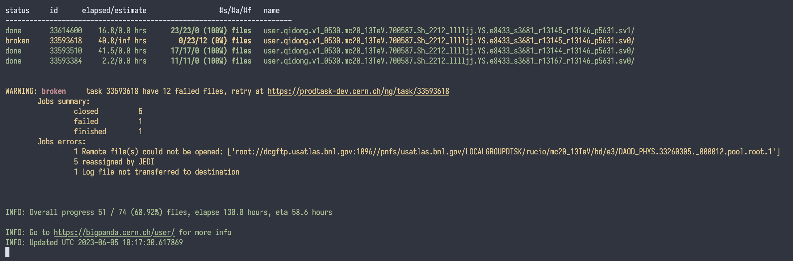

# bandamon - (hopefully) a better pandamon :0

## installation
```
pip install --index-url https://test.pypi.org/simple/ bandamon
```
## usage
```
usage: bandamon [-h] [-e EXPRESSIONS [EXPRESSIONS ...]] [-v INVERSES [INVERSES ...]] [-u USER] [-d] [-l] [-s] [-a]

options:
  -h, --help            show this help message and exit
  -e EXPRESSIONS [EXPRESSIONS ...], --expressions EXPRESSIONS [EXPRESSIONS ...]
  -v INVERSES [INVERSES ...], --inverses INVERSES [INVERSES ...]
  -u USER, --user USER  User interested
  -d, --detail          show job details
  -l, --loop            None stop monitoring
  -s, --show_done       show done jobs
  -a, --print_all       show all
```
## example output
```
$ bandamon -e v1_0530 700587 -l -d
```


## credit
Code largely came from the following project
https://pypi.org/project/pandamonium
